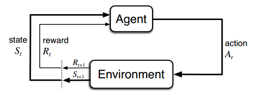

# 大模型微调方法简明指南

## 什么是大模型微调？

想象你买了一辆通用型汽车，它可以满足基本出行需求，但如果你想让它更适合越野或赛道，就需要进行一些调整。大模型微调就是这样一个过程——我们拿到一个通用型AI模型（如GPT、BERT等），然后通过特定的技术手段让它在特定领域或任务上表现得更好。

微调就像是给模型补充"专业课程"，让它从"通才"变成特定领域的"专才"。

## 为什么需要微调？

1. **通用模型不够专业**：大模型虽然知识广泛，但在特定领域（如医疗、法律、金融等）可能缺乏专业深度
2. **定制化需求**：企业可能需要模型理解公司特有的术语、流程和知识
3. **资源限制**：从零训练大模型需要海量算力和数据，而微调只需要少量资源
4. **效果提升**：在特定任务上，经过微调的模型往往比通用模型表现更好

## 七种主流微调方法及其通俗解释

### 1. 全参数微调（Full Fine-tuning）

**通俗理解**：就像重新教育一个已经上过大学的人。你拿到预训练模型后，用新数据重新训练所有参数。

**类比**：给一位通用医生提供大量皮肤病例，让他专攻皮肤科。

**优点**：
- 效果通常最好，因为所有参数都针对新任务进行了调整

**缺点**：
- 计算成本高，需要大量GPU内存
- 容易过拟合（如果数据量不够大）
- 可能会"遗忘"原有知识

**适用场景**：
- 拥有充足计算资源
- 有大量高质量领域数据
- 追求最佳性能

### 2. LoRA（低秩适应）

**通俗理解**：不直接修改原始知识，而是给模型装上"小抄"，在需要时查阅。技术上，它通过添加小型可训练矩阵来实现微调。

**类比**：不改变医生的基础知识，只给他一本皮肤科小册子，需要时翻阅参考。

**优点**：
- 参数效率高，通常只需训练不到1%的参数
- 内存占用小，训练速度快
- 模型可以轻松切换任务（通过更换LoRA适配器）

**缺点**：
- 性能可能略低于全参数微调
- 调整不当可能导致不稳定

**适用场景**：
- 计算资源有限
- 需要快速为不同任务切换同一模型
- 需要保留原模型能力同时获得新能力

### 3. QLoRA（量化LoRA）

**通俗理解**：在LoRA的基础上，先将大模型"压缩"（量化），再进行微调，进一步节省资源。

**类比**：将医学教科书压缩成口袋书，再添加皮肤科小笔记。

**优点**：
- 比LoRA更节省内存（可降低至1/10）
- 能在消费级GPU（如RTX 3090）上微调大型模型
- 性能接近全参数微调

**缺点**：
- 计算速度可能变慢
- 需要特定库支持

**适用场景**：
- 计算资源极其有限
- 需要在消费级硬件上微调大模型

### 4. P-Tuning（提示调整）

**通俗理解**：不调整模型本身，而是学习如何更好地"提问"。就像学习如何提示ChatGPT一样，P-Tuning是让模型自己学习最佳提示方式。

**类比**：教会医生如何提出正确的问题，而不是教他新知识。

**优点**：
- 极其参数高效（通常小于0.1%的参数）
- 防止灾难性遗忘
- 适合较小规模任务

**缺点**：
- 对大型任务效果可能有限
- 不适合需要深度领域知识的任务

**适用场景**：
- 资源极度受限
- 简单分类或问答任务
- 希望保留模型通用能力

### 5. Prefix-Tuning（前缀调整）

**通俗理解**：在输入前面添加一些特殊标记，这些标记会根据特定任务进行优化。就像给医生一段特殊的开场白，这段话能引导他进入专业状态。

**类比**：在每个问题前添加"请以皮肤科专家的身份回答："，并优化这个提示。

**优点**：
- 参数高效
- 适合自然语言生成任务
- 可以同时处理多个任务

**缺点**：
- 对大型模型效果可能有限
- 实现相对复杂

**适用场景**：
- 文本生成任务
- 对话系统定制

### 6. Adapter Tuning（适配器调整）

**通俗理解**：在模型中添加小型"适配器"模块，只训练这些模块，原模型保持不变。

**类比**：给医生配备专业的皮肤科诊断工具，但医生的基础知识不变。

**优点**：
- 参数效率高
- 可以为不同任务训练不同适配器
- 保留原始模型能力

**缺点**：
- 推理速度可能变慢
- 实现相对复杂

**适用场景**：
- 多任务学习
- 需要频繁切换任务场景

### 7. RLHF（基于人类反馈的强化学习）

**通俗理解**：通过人类评价来指导模型学习什么是"好"回答。就像给医生的诊断进行点评，告诉他哪些做得好，哪些需要改进。

**类比**：让医生实习，每次诊断后给予详细反馈，逐步提升能力。

**优点**：
- 能够对齐人类价值观和偏好
- 提高模型输出质量和安全性
- 减少有害输出

**缺点**：
- 实现复杂，需要三个阶段（监督微调、奖励模型训练、强化学习）
- 需要大量高质量人工反馈
- 计算成本高

**适用场景**：
- 构建安全可靠的AI助手
- 需要模型输出符合人类价值观和偏好
- 对输出质量要求极高的场景

## 如何选择适合自己的微调方法？

选择合适的微调方法，可以从这几个维度考虑：

1. **计算资源**：
   - 资源充足：全参数微调、RLHF
   - 资源有限：LoRA、Adapter Tuning
   - 资源极少：QLoRA、P-Tuning

2. **数据量**：
   - 数据充足：全参数微调、RLHF
   - 数据有限：LoRA、QLoRA
   - 数据很少：P-Tuning、Prefix-Tuning

3. **任务类型**：
   - 通用对话：RLHF
   - 文本生成：Prefix-Tuning、LoRA
   - 分类任务：Adapter Tuning、P-Tuning

4. **性能要求**：
   - 追求极致性能：全参数微调
   - 平衡性能和资源：LoRA、QLoRA
   - 注重特定能力：Adapter Tuning

## 微调实战小贴士

1. **数据质量胜过数量**：几千条高质量数据往往比几万条低质量数据效果更好

2. **循序渐进**：先尝试参数少的方法（如LoRA），不满意再尝试更复杂的方法

3. **学习率很关键**：微调时学习率通常需要比预训练小得多

4. **评估很重要**：建立合理的评估机制，避免过拟合

5. **注意灾难性遗忘**：全参数微调容易导致模型"忘记"原有知识

## 不同微调方法的参数和资源对比

| 微调方法 | 可训练参数比例 | GPU内存需求 | 训练速度 | 效果 | 实现复杂度 |
|---------|-------------|-----------|--------|-----|----------|
| 全参数微调 | 100% | 非常高 | 慢 | 最佳 | 简单 |
| LoRA | 0.1%-1% | 中等 | 快 | 良好 | 中等 |
| QLoRA | 0.1%-1% | 低 | 中等 | 良好 | 中等 |
| P-Tuning | <0.1% | 很低 | 很快 | 中等 | 中等 |
| Prefix-Tuning | <1% | 低 | 快 | 中等 | 复杂 |
| Adapter Tuning | 1%-5% | 中等 | 中等 | 良好 | 复杂 |
| RLHF | 变化大 | 非常高 | 非常慢 | 优秀 | 非常复杂 |

## 结语

微调是让通用大模型变成专属助手的关键技术。随着技术的发展，微调方法正变得越来越高效。无论你是资源有限的个人开发者，还是追求极致性能的大型企业，都能找到适合自己的微调方法。

记住，最好的微调方法不是最复杂的，而是最适合你特定需求和资源条件的那个。

## 学习资源

- [Hugging Face PEFT文档](https://huggingface.co/docs/peft/index)
- [LLaMA-Factory项目](https://github.com/hiyouga/LLaMA-Factory)
- [FastChat项目](https://github.com/lm-sys/FastChat)
- [DeepLearning.AI微调课程](https://www.deeplearning.ai/short-courses/finetuning-large-language-models/)

---

*参考资料: [大模型微调的7种神级方法](https://blog.csdn.net/EnjoyEDU/article/details/144856865)* 